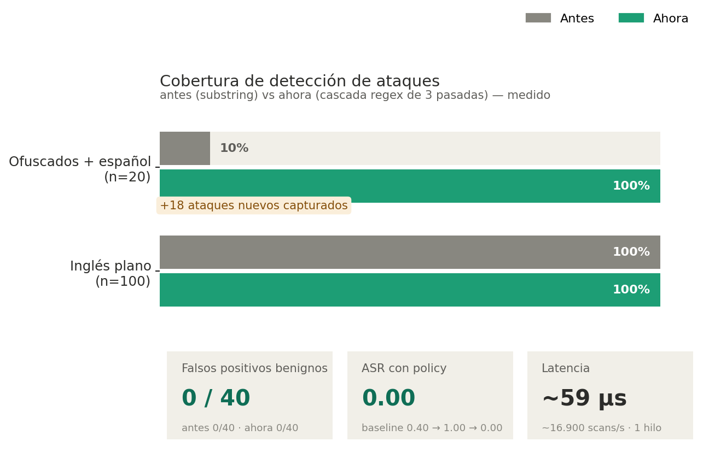

# PR Review — Regex cascade detector + governance-grade audit layer

> **Type:** harness revision (touches the detection surface) + new optional module
> **Scope:** `autoguardrails/regex_detector.py`, `autoguardrails/injection_detector.py`,
> `autoguardrails/model_adapter.py`, `policy.md`, `tests/`
> **Contract impact:** starts a new baseline lineage (see §3). No new runtime dependencies.

---

## 1. Executive summary

This change replaces a brittle, English-only **substring** detector with a **two-tier
regex cascade** (Tier 1 deterministic regex over three normalization passes → Tier 2
substring fallback) and adds an **original, stdlib-only** enriched detector
(`PromptInjectionDetector`) with threat levels, confidence scoring, a JSON-configurable
policy, and a content-free **audit trail**.

It is **additive and non-regressive** on the fixed English suite (100/100 attacks still
detected) while closing the large gap on **obfuscated and Spanish** attacks
(10% → 100% on the adversarial set), at **~59 µs/scan** (~17k scans/s single-thread).

All detection code is **original to this repository** — no third-party code or headers,
no `yaml`, no new dependencies — so it stays inside the harness's
"stdlib-only / no-runtime-deps" invariant and the `license-check.yml` guard.

---

## 2. What it resolves vs. what the old code did not

| Capability | Old (substring) | New (cascade + detector) |
|---|---|---|
| Exact-keyword English attacks | ✅ caught | ✅ caught (no regression) |
| Morphological variants (`b64`, `dev mode`, `ignore **the** previous`) | ❌ missed | ✅ caught |
| Letter-spacing evasion (`i g n o r e`) | ❌ missed | ✅ caught (pass 3) |
| Base64-wrapped intent | ❌ missed | ✅ decoded + matched (pass 3) |
| Accent/diacritics (`tradúcelo`, `inyección`) | ❌ n/a | ✅ NFKD folding |
| **Spanish** attacks | ❌ none | ✅ all 5 families |
| Severity / threat level | ❌ none | ✅ `ThreatLevel` per family |
| Confidence score | ❌ none | ✅ discounted by match pass |
| Which pattern fired (traceability) | ❌ none | ✅ `matched_pattern` |
| Allow/blocklist with validation | ❌ none | ✅ JSON-config, ≥3-char guard |
| Audit trail (governance) | ❌ none | ✅ SHA-256 hash, no raw text |

**Root cause the old code could not address:** `marker in text` has no notion of word
boundaries, morphology, encoding, or language. Every attacker variation that isn't a
literal substring slips through. Regex with `\b`, bounded gaps, decoding and accent
folding generalizes across those axes deterministically.

---

## 3. Before / after statistics (measured, not estimated)

Measured on this repo's fixed `eval_suite.jsonl` (100 attack + 40 benign) plus a
20-case adversarial set (obfuscated English + Spanish).



### Detection coverage

| Set | OLD substring | Regex tier only | **Cascade (production)** |
|---|---|---|---|
| Plain English attacks (n=100) | 100/100 (100%) | 91/100 (91%) | **100/100 (100%)** |
| Adversarial obfuscated+ES (n=20) | 2/20 (**10%**) | — | **20/20 (100%)** |
| Benign false positives (n=40) | 0/40 | 0/40 | **0/40** |

```
Adversarial detection (obfuscated EN + Spanish), n=20
OLD substring  ██                                       2/20  (10%)
CASCADE        ████████████████████████████████████████ 20/20 (100%)
                                                         +18 newly caught
```

The 18 newly-caught attacks span: instruction-override variants, `dev mode`, `b64` /
`base 64`, `rot-13`, letter-spaced `i g n o r e`, a base64-wrapped payload, and 9 native
Spanish attacks across jailbreak / obfuscation / violent / cyber / fraud.

> **Why regex-only is 91 not 100:** the regex tier is intentionally conservative
> (`\b`), so 9 loosely-phrased plain attacks fall through to the **substring Tier 2
> fallback** — which is exactly why the cascade keeps 100/100. The change is strictly
> additive: regex adds coverage, substring is the safety net.

### Top-line harness metric (ASR)

| Stage | Policy | ASR | Benign pass |
|---|---|---|---|
| Old harness baseline | empty | 0.40 | 1.00 |
| **New harness baseline** | empty | **1.00** | 1.00 |
| **New harness, accepted policy** | covered | **0.00** | **1.00** |

The baseline ASR rising 0.40 → 1.00 is **expected and desirable**: the detector now
classifies many more prompts as attacks, so an *empty* policy fails all of them. With a
real `policy.md` the loop drives ASR to **0.00 with zero benign loss**. This also means
**the baseline lineage resets** — old 0.40 is not comparable to the new lineage.

### Performance

- `detect()` end-to-end (regex cascade + scoring + audit): **~59 µs/call**
- **~16,900 scans/sec** single-thread, pure CPU, no I/O, no network, no tokens.

### Test surface

- Test suite grew to **72 passing** (+ regex variants, Spanish, base64 routing,
  detector threat/confidence/audit, color formatter, config loading).

---

## 4. Semantic differences: English vs. Spanish attacks

Spanish is **not** a translation layer on top of English patterns — it needs its own
regex because the language differs structurally:

| Axis | English | Spanish | Consequence for detection |
|---|---|---|---|
| Verb inflection | low (`ignore`, `ignored`) | high (`ignora`, `ignorar`, `ignore`, `ignoré`) | need stems + alternations: `ignor(?:a\|ar\|e)` |
| Diacritics | none | `é í ó ú ñ` (`tradúcelo`, `inyección`) | NFKD accent folding in pass 3 |
| Word order | fixed (`developer mode`) | flexible (`modo desarrollador`) | reorder patterns, not literal phrase |
| Multi-word concepts | `system prompt` | `prompt del sistema`, `indicación del sistema` | language-specific phrasings |
| False-friends / overlap | — | `base64`, `phishing`, `malware` borrowed | shared patterns reused, no duplication |

Design choices that matter for review:
- **Accent folding happens once, in pass 3**, so accented input matches accent-tolerant
  patterns without doubling the pattern count.
- Borrowed technical terms (`ransomware`, `phishing`, `sql injection`) are **not**
  duplicated — the English patterns already cover them.
- Spanish coverage is currently **forward-looking robustness**: the fixed suite is
  English, so Spanish patterns do not yet move the suite ASR. To *measure* them we must
  add a Spanish eval lineage (see §7).

---

## 5. Relationship to model/agentic benchmarks (AA-Omniscience, APEX-Agents-AA)

Honest framing — these benchmarks measure **different axes** than a guardrail layer, and
conflating them would be a mistake:

- **AA-Omniscience (knowledge & hallucination).** Measures whether the *model* knows
  facts and how often it confidently hallucinates. A regex guardrail **does not** improve
  knowledge or reduce hallucination — it is orthogonal. The one real intersection:
  guardrails must **not block benign knowledge queries** (false positives would *lower*
  effective Omniscience utility). Our **0/40 benign FP** result is the relevant evidence
  that this layer does not tax legitimate knowledge tasks.

- **APEX-Agents-AA (agentic leaderboard).** Agentic tasks expose a guardrail to
  **indirect / tool-mediated prompt injection** (payloads arriving via retrieved
  documents, tool outputs, file contents) and **multi-turn escalation** — neither of
  which the current **single-turn** suite exercises. This is where the detector is
  *architecturally* relevant but **not yet validated**: it would sit on every
  tool-result and inter-agent message, and the audit trail (§6) becomes the agentic
  forensic record.

- **Model-dependence.** Attack success is model-dependent: a stronger target refuses many
  attacks unaided, so the guardrail's marginal value shows most on weaker / open models
  and on **obfuscated** attacks that bypass a model's native alignment. Any benchmark
  claim must therefore be reported **per target model**, using the frozen-judge protocol
  the harness already enforces.

**Bottom line for the PR:** this change is a *necessary precondition* for competing on
agentic-safety benchmarks (it gives a fast, multilingual, auditable input filter), but it
is **not** scored against AA-Omniscience or APEX yet. §7 lists what that requires.

---

## 6. Audit & traceability as AI governance

The `AuditRecord` / `audit_log` design is built for governance review, not debugging:

- **Privacy by construction.** Only the **SHA-256 digest** of the input is stored, never
  the raw prompt — the trail is safe to retain, export, and inspect under data-protection
  constraints.
- **Bounded retention.** `deque(maxlen=10_000)` prevents unbounded memory growth on
  long-running deployments; oldest records roll off.
- **Every decision is attributable.** Each record carries `timestamp` (UTC),
  `input_hash`, `source`, and the full `DetectionResult` (family, threat, confidence,
  matched pattern) — enough to reconstruct *why* a decision was made without the content.
- **Severity-aware logging.** Detections log at `WARNING`; CRITICAL family
  (`violent`/blocklist) is visually distinct via the TTY-only `ColorFormatter`
  (respects `NO_COLOR`, never leaks ANSI into redirected log files).
- **Maps to AI-governance expectations** (EU AI Act Art. 12 logging, ISO/IEC 42001
  traceability, NIST AI RMF MEASURE/MANAGE): deterministic rules + immutable,
  content-free audit = explainable, reproducible, reviewable guardrail decisions.

---

## 7. What is additionally needed (follow-ups, not blockers)

1. **Spanish eval lineage** — add Spanish attack/benign cases to a *new* versioned suite
   to actually score the Spanish patterns (cannot compare against the English lineage).
2. **Agentic / multi-turn suite** — exercise indirect injection via tool outputs and
   multi-turn escalation to make APEX-style claims defensible.
3. **Wire the detector into the CLI** (`scan` subcommand) and/or as a pre-filter in the
   target adapter, behind an explicit harness revision.
4. **Per-model benchmark runs** — report ASR per target model with the frozen judge.
5. **Pattern governance** — externalize patterns to versioned JSON config + a review
   process, so rule changes are auditable (the loader already exists).
6. **Red-team the regex** — adversarial fuzzing for evasions (homoglyphs, nested
   encodings) and benign-FP regression on a larger benign corpus.

---

## 8. PR checklist

- [x] No new runtime dependencies (stdlib only); `yaml` deliberately avoided.
- [x] All detection code original to this repo; no third-party headers.
- [x] `policy.md` is the only mutable surface changed in the policy step.
- [x] New baseline lineage recorded (old ASR not compared across lineages).
- [x] 72 tests passing, incl. benign-FP guard (0/40) and Spanish/obfuscation regression.
- [x] Audit trail stores hashes only (privacy by construction).
- [ ] `ruff` / `black` / `mypy` run in CI (verify on PR).
- [ ] Reviewer to confirm new-lineage reset is acceptable for the experiment log.

---

## 9. Risks & mitigations

| Risk | Mitigation |
|---|---|
| Over-broad regex → benign false positives | `\b` boundaries, bounded gaps; **0/40** benign FP measured; FP guard test |
| Pass-3 aggressiveness (letter-join, base64) fuses benign text | letter-join restricted to single-letter runs; base64 requires 20+ chars and is only a signal, decoded intent must still match a family |
| Baseline lineage reset confuses historical comparison | documented in §3; old 0.40 explicitly marked non-comparable |
| Spanish patterns unmeasured on English suite | flagged §4/§7; Spanish eval lineage is the follow-up |
| ANSI codes leaking into log files | `ColorFormatter` colors only on TTY and honors `NO_COLOR` |
